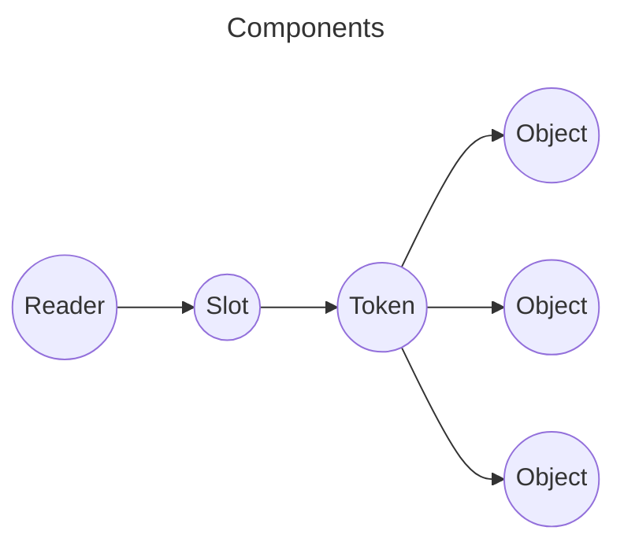

-------------
## Your very own HSM! (sort of)
**SoftHSM2** is a software HSM emulator and reference implementation by NLnet Labs.  
Thanks to them you can use it for **free**. [link](https://github.com/opendnssec/SoftHSMv2)  
SoftHSM2 is installed on the SIDN provided login server. Else you can probably install it with your package manager.

*But* it has **no networking** and it needs to be installed on the server that needs to use the HSM,  
unless you are able to bolt-on some proxy for networking. E.g. by using p11-kit in server mode.

[p11-glue 0.25 (includes p11-kit): using PKCS#11 to unite crypto libraries](https://p11-glue.github.io/p11-glue/p11-kit.html)

[Virtual PKCS #11 Module SoftHSMv2 by Primos TI](https://github.com/PrimosTI/softhsm2) (take a look in the 'samples' directory)

[Vegardit/docker-softhsm2-pkcs11-proxy](https://github.com/vegardit/docker-softhsm2-pkcs11-proxy/blob/main/README.md)

[PowerDNS PKCS#11 with p11-kit](https://doc.powerdns.com/authoritative/dnssec/pkcs11.html)

[A Stack Overflow thread on the subject](https://stackoverflow.com/questions/56756141/expose-softhsm-library-to-the-code-running-in-host-machine)

[A ServerFault thread on the subject](https://serverfault.com/questions/1166723/pkcs11-forwarding-clarifying-client-and-server-confusion)

[An OpenSC GitHub issue on the subject](https://github.com/OpenSC/libp11/issues/437)

**Kryoptic** Is a new, but similar, project to create a software HSM emulator and reference implementation in Rust:  
[link](https://github.com/latchset/kryoptic), also see [this blog by rcritten](https://rcritten.wordpress.com/2024/10/01/trying-a-new-pkcs11-driver-kryoptic/).  
A pre-build Kryoptic is included in the github repository of this workshop, works on Ubuntu Noble and Debian Bookworm YMMV.

*Also* it has no **networking**.

*Please note:* SoftHSM2, and Kryoptic are both excellent tools for testing, saving you a **lot** of money.  
But, both are not true HARDWARE security modules and your secret keys are **in RAM** on the server that also hosts the software using it. And this software is possibly exposed to the internet.  

*Nice*: SoftHSM2 is a **drop-in** for a real HSM, this means you have to change very little when switching to a real HSM.

--------------------
## Exercise "Introducing SoftHSM2 by NLnet Labs"
If you are **not** using the SIDN provided login server **and** not running as root:
```bash
# sudo -i OR su -
apt install -y softhsm2 man sudo
usermod -aG softhsm your_username   ### !!! so non-root user can read /etc/softhsm/softhsm2.conf
usermod -aG sudo your_username      ### !!! make sure your non-root user can use sudo
```
------------
SoftHSM has virtual **"slots"**, in which a **"token"** is automatically placed (like a card reader or USB port)  
***Token is just the term used for a device or virtual device that can do crypto operations, (like a smartcard or an USB-HSM).***    
SoftHSM just creates a new slot for every token you initialise.  
Kryoptic does the oposite, it creates a (single) token if you initialise a slot.  
Nitrokey NetHSM has only 1 slot with only 1 token, but it has 'namespaces' and every namespace has its own slot-token  
Thales has 'partitions' that function as as complete virtual HSM and are used as a slot-token.  
Take away: Different vendors do things differently.

A token can contain lots of key objects. [illustration](https://github.com/tpm2-software/tpm2-pkcs11/blob/master/docs/illustrations/reader-slot-token-obj.png)  

```bash
sudo softhsm2-util --show-slots
softhsm2-util --show-slots
# note: these are 2 different virtual card readers if you are running as a non-root user
```
Slots are numbered, but SoftHSM always has an empty slot available/created for a new token slot.  
SoftHSM keeps its users separated, user_x cannot list user_y's slots. *But root sees all*.

**Note:** Here you meet for the first time a **vendor tool** for using an HSM.  
SoftHSM -> softhsm2-util  
Thales -> lunacm, vtl, etc.  
NitroKey NetHSM -> nitropy  
Kryoptic -> no tool available afaik  
Also: OpenDNSSEC -> ods-hsmutil (not an HSM vendor, also: the HSM is not addressed directly)  
Also: Knot -> keymgr (not an HSM vendor, also: the HSM is not addressed directly)

---------------------------------

#### RTFM:
```bash
man softhsm2-util
```
Here you read what it is, and what it does: list, init, delete, import, user management.  
But you'll see **no 'encrypt' or 'sign' commands** and you cannot just give SoftHSM a file 
and expect it to be signed or encrypted.
You need middleware, more on that later!

-------------
#### Your first token
```bash
softhsm2-util --init-token --free --label "Token1" --pin 0000 --so-pin 1234  # owned by current user!
softhsm2-util --show-slots     # use sudo if you want to see all slots
```
Notice that a token has been "inserted" (with an unexpected number), and a new free slot was created (also with an unexpected number)  
(--free just means: use first empty slot, so you do not have to look first)

The pin is a PIN (password) for using the token, but why twice? Because there are **2 users/roles** in SoftHSM.  
In SoftHSM the normal user can do crypto operations using the key objects in the token, and create or destroy tokens.  
In SoftHSM the Security officer ("SO") can reinitialise a token, not much else can be known from the documentation.

-------------
**NOTE** no keys are on this token yet! The token is just the cryptomodule, and softhsm2-util is not the tool for creating keys.
```bash
cat /etc/softhsm/softhsm2.conf
ls -lR /var/lib/softhsm/tokens/  # use sudo if you want to see all slots
```
The way that SoftHSM "packages" keys on disk is explained in more detail [here](https://web.archive.org/web/20230607235223/https://xakcop.com/post/softhsmv2/)  
Note: if you compiled SoftHSM yourself, you could have an Sqlite3 db in /var/lib/softhsm/tokens/  
try: sqlite3 /var/lib/softhsm/tokens/....../sqlite3.db and the command .dump to see all (hint: .quit/.help).

Please note: As I mentioned earlier, SoftHSM isolates its slots/tokens, a token created by a user is unavailable to other users.
This means that if you are creating tokens for a different user (e.g. Bind, Knot, OpenDNSsec) you need to use sudo.

-------------------
[Next](https://github.com/niek-sidn/hsm_workshop_nethsm/blob/main/Slide12.md)
